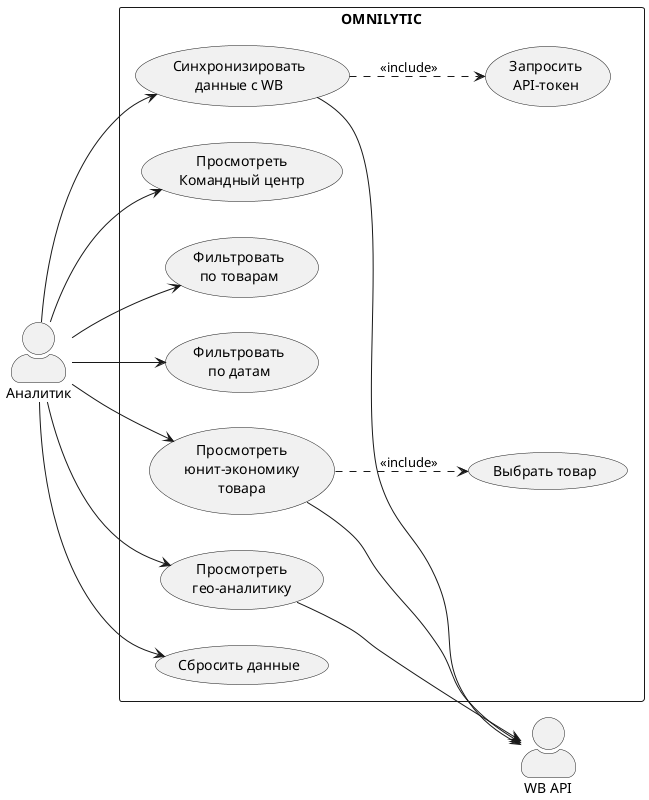
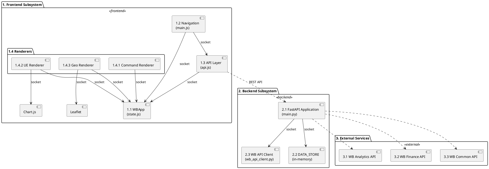

Понял. Пишу полный документ целиком. Это будет большой объём — представлю его как единый файл.

---

```markdown
# ТЕХНИЧЕСКОЕ ОПИСАНИЕ СИСТЕМЫ OMNILYTIC
## Аналитический дашборд для продавцов Wildberries

---

## 1. АРХИТЕКТУРНЫЙ ОБЗОР

### 1.1 Тип системы и стек технологий

**Общее описание:**
Omnilytic — это одностраничное веб-приложение (SPA) для аналитики продавцов на маркетплейсе Wildberries. Система агрегирует данные из нескольких API Wildberries, обогащает их вычисляемыми метриками и представляет в виде интерактивного дашборда с тремя аналитическими разделами.

**Принцип работы:**
Пользователь вводит API-токен Wildberries и период анализа. Бэкенд запрашивает данные у внешних API Wildberries, обрабатывает их и кэширует. Фронтенд загружает данные и отрисовывает три раздела: Командный центр (KPI, воронка продаж), Юнит-экономика (финансовая аналитика по товару) и Гео-аналитика (распределение продаж по складам на карте).

**Стек технологий:**

| Слой | Технологии | Назначение |
|------|------------|------------|
| **Backend** | Python 3.11, FastAPI 0.104.1, Uvicorn, httpx, pandas | HTTP-сервер, REST API, обработка данных |
| **Frontend** | Vanilla ES6+ (IIFE-модули), Chart.js 4, Leaflet 1.9, CSS Grid/Flex | Пользовательский интерфейс, визуализация |
| **Внешние API** | WB Analytics API, WB Finance API, WB Common API | Источники данных |
| **Хранилище** | In-memory DATA_STORE (словарь в оперативной памяти) | Сессионное хранение данных |

### 1.2 Архитектура приложения

**Общая архитектурная схема:**

```
┌─────────────────────────────────────────────────────────────┐
│                     БРАУЗЕР ПОЛЬЗОВАТЕЛЯ                    │
│  ┌─────────────────────────────────────────────────────────┐│
│  │  Frontend: 6 JS-модулей + HTML + CSS                    ││
│  │  (state, api, main, render-command, render-unit-econ,   ││
│  │   render-geo-analytics)                                  ││
│  │  Библиотеки: Chart.js (графики), Leaflet (карта)        ││
│  └─────────────────────────┬───────────────────────────────┘│
└─────────────────────────────┼───────────────────────────────┘
                              │ HTTP-запросы (fetch)
                              ▼
┌─────────────────────────────────────────────────────────────┐
│                     СЕРВЕР (port 8000)                       │
│  ┌─────────────────────────────────────────────────────────┐│
│  │  FastAPI Application                                    ││
│  │  ┌──────────────┐  ┌──────────────┐  ┌──────────────┐  ││
│  │  │ REST API     │  │ WB API Client│  │ DATA_STORE   │  ││
│  │  │ (14 эндпоинт)│  │ (rate limit) │  │ (кэши + данные)│  ││
│  │  └──────────────┘  └──────────────┘  └──────────────┘  ││
│  └─────────────────────────┬───────────────────────────────┘│
└─────────────────────────────┼───────────────────────────────┘
                              │ HTTP-запросы (httpx)
                              ▼
┌─────────────────────────────────────────────────────────────┐
│                   ВНЕШНИЕ API WILDBERRIES                    │
│  ┌──────────────┐ ┌──────────────┐ ┌──────────────┐         │
│  │ WB Analytics │ │ WB Finance   │ │ WB Common    │         │
│  │ (Sales Funnel│ │ (Sales       │ │ (Tariffs)    │         │
│  │  Search Rpt) │ │  Reports)    │ │              │         │
│  └──────────────┘ └──────────────┘ └──────────────┘         │
└─────────────────────────────────────────────────────────────┘
```

**Как работает взаимодействие:**
1. Фронтенд отправляет HTTP-запросы на бэкенд (localhost:8000)
2. Бэкенд проверяет наличие данных в кэше (DATA_STORE)
3. Если кэш пуст — делает запрос к внешнему API Wildberries с задержками (rate limiting)
4. Полученные данные обрабатываются и кэшируются
5. Результат возвращается фронтенду
6. Фронтенд отрисовывает визуальные компоненты (графики, таблицы, карта)

### 1.3 Внешние API: что это, зачем, как работают

Wildberries предоставляет несколько REST API для продавцов. Каждый API решает свою задачу и имеет свои ограничения по частоте запросов.

**1) WB Analytics API — Sales Funnel (воронка продаж)**

- **Что это:** API для получения воронки продаж по товарам — от показов карточки до покупки и возврата.
- **Зачем вызывается:** Получить данные о impressions (показы), CTR (кликабельность), cart views (просмотры корзины), orders (заказы), purchased (оплачено), cancelled (отменено) для каждого товара. Эти данные используются для расчёта конверсий и построения воронки в Командном центре.
- **Как вызывается:** GET-запрос с API-токеном в заголовке, параметры: dateFrom, dateTo, limit, rrdid (для пагинации).
- **Лимит:** 3 запроса в минуту (personal token). Задержка между запросами: 21 секунда.
- **Формат ответа:** JSON с массивом объектов, каждый содержит nmId (идентификатор товара) и метрики воронки.

**2) WB Analytics API — Search Report (поисковая видимость)**

- **Что это:** API для получения данных о видимости товаров в поиске Wildberries — по каким запросам показываются товары и как часто пользователи переходят по ним.
- **Зачем вызывается:** Получить данные о visibility (видимость в поиске), ctr (кликабельность в поиске) для каждого товара. Эти метрики показывают, насколько эффективно товар находится покупателями через поиск.
- **Как вызывается:** GET-запрос с API-токеном, параметры: dateFrom, dateTo, limit, rrdid.
- **Лимит:** 3 запроса в минуту.
- **Особенность:** Требует уровень доступа Jam tier. Если токен не имеет этого уровня — API возвращает ошибку 403. Система обрабатывает это через graceful degradation: вместо ошибки показываются прочёрки (—), данные берутся из Sales Funnel.
- **Формат ответа:** JSON с массивом объектов, каждый содержит nmId и метрики поисковой видимости.

**3) WB Finance API — Sales Reports Detailed (финансовые отчёты)**

- **Что это:** API для получения детальных финансовых отчётов по каждой транзакции — выручка, комиссии, логистика, хранение, штрафы по каждой продаже/возврату.
- **Зачем вызывается:** Получить финансовую разбивку по каждой транзакции: retailPriceWithDisc (выручка), ppvz_for_pay (к продавцу), fee (компенсация), processing (обработка), storage (хранение), delivery (логистика), additionalPayment (доплата), penalty (штраф), purchasedBoxes (коробки). Эти данные используются для расчёта юнит-экономики и гео-аналитики.
- **Как вызывается:** GET-запрос с API-токеном, параметры: dateFrom, dateTo, limit (макс. 100 000), rrdid (для пагинации).
- **Лимит:** **1 запрос в минуту** (самый строгий). Задержка между запросами: 67 секунд + 2 секунды запаса.
- **Особенность:** Это самый ресурсоёмкий API. При большом объёме данных (более 100 000 транзакций) общее время загрузки может превышать 2 минуты.
- **Формат ответа:** JSON с массивом объектов (до 100 000 за запрос), каждый содержит nmId, saleID, officeName (склад), retailPriceWithDisc и финансовые компоненты.

**4) WB Common API — Tariffs (тарифы комиссий)**

- **Что это:** API для получения стандартных тарифов комиссий Wildberries по категориям товаров — какой процент берёт маркетплейс за продажу в каждой категории.
- **Зачем вызывается:** Сравнить стандартный тариф Wildberries с фактической комиссией продавца для определения переплаты или экономии.
- **Как вызывается:** GET-запрос с API-токеном, параметры: month (месяц в формате YYYY-MM).
- **Лимит:** 3 запроса в минуту.
- **Формат ответа:** JSON с объектом-словарём, ключи — ID категорий, значения — объекты с полем perc (процент комиссии).

---

## 2. БЭКЕНД — ДЕТАЛЬНАЯ СПЕЦИФИКАЦИЯ

### 2.1 REST API: методы и эндпоинты

**Почему GET vs POST:**
REST API различает два основных HTTP-метода. **GET** используется для **чтения** данных — запрос не изменяет состояние сервера, является идемпотентным (повторный запрос возвращает тот же результат). **POST** используется для **создания или изменения** данных — запрос может модифицировать состояние сервера и требует передачи тела запроса (body).

| Эндпоинт | Метод | Назначение | Почему именно этот метод |
|----------|-------|------------|--------------------------|
| `/api/fetch-from-wb` | POST | Синхронизация данных с WB | Изменяет состояние DATA_STORE |
| `/api/upload` | POST | Загрузка файла данных | Создаёт новые данные в системе |
| `/api/unit-economics` | POST | Юнит-экономика товара | Ресурсоёмкий запрос, требует body |
| `/api/ai/analyze` | POST | ИИ-рекомендации | Отправка запроса во внешний API |
| `/api/reset` | POST | Полный сброс данных | Изменяет состояние DATA_STORE |
| `/api/dashboard/summary` | GET | KPI и воронка | Только чтение, без побочных эффектов |
| `/api/dashboard/hits` | GET | Топ товаров | Только чтение |
| `/api/dashboard/outsiders` | GET | Проблемные товары | Только чтение |
| `/api/dashboard/matrix` | GET | BCG-матрица | Только чтение |
| `/api/dashboard/actions` | GET | Рекомендации | Только чтение |
| `/api/filter-options` | GET | Список товаров | Только чтение |
| `/api/geo/summary` | GET | Гео-агрегация | Только чтение (из кэша или API) |
| `/api/export/excel` | GET | Экспорт в Excel | Генерация файла (не изменяет данные) |

### 2.2 DATA_STORE: общее хранилище данных

**Общее описание:**
DATA_STORE — это глобальная in-memory структура данных (словарь Python), которая хранит всё состояние приложения в течение сессии. Все эндпоинты FastAPI работают с одним и тем же экземпляром DATA_STORE. При рестарте сервера данные теряются.

**Зачем нужен:**
Без DATA_STORE каждый запрос к эндпоинту пришлось бы заново запрашивать данные у WB API (что невозможно из-за лимитов). DATA_STORE работает как буфер: данные загружаются один раз и переиспользуются всеми эндпоинтами.

**Структура DATA_STORE:**

| Ключ | Тип | Назначение |
|------|-----|------------|
| `raw_data` | list[dict] | Обработанные записи товаров (результат process_data) |
| `processed_data` | list[dict] | То же, что raw_data (для совместимости) |
| `period` | dict | Текущий и предыдущий периоды: {from, to, prev_from, prev_to} |
| `filename` | str | Имя источника данных: "API: ..." или имя файла |
| `source` | str | Источник: "excel" или "wb_api" |
| `search_report_metrics` | dict | Метрики видимости в поиске (visibility, ctr) |
| `metrics_availability` | dict | Доступность каждой метрики: {available: bool, reason: str} |
| `metrics_origin` | dict | Источник каждой метрики: "excel" / "sales_funnel" / "search_report" |
| `wb_api_key` | str | Сохранённый API-токен для повторных запросов |
| `dashboard_cache` | dict | Кэш дашборда (ключ: api_key\|date_from\|date_to) |
| `unit_cache` | dict | Кэш юнит-экономики (ключ: api_key\|date_from\|date_to\|product_id) |
| `commission_cache` | dict | Кэш тарифов комиссий (ключ: api_key) |
| `geo_cache` | dict | Кэш гео-агрегации (ключ: api_key\|date_from\|date_to) |

### 2.3 Обработка данных: от записи до аналитики

**Общее описание:**
Сырые данные из WB API содержат числовые показатели (impressions, orders, revenue). Система обогащает их: вычисляет динамику (процент изменения между периодами), конверсии воронки, категории BCG, и преобразует форматы для отображения.

**Что происходит с данными:**
1. **Получение:** WB API возвращает JSON-массив с числовыми полями
2. **Преобразование формата:** `map_api_to_internal()` переименовывает поля из формата WB во внутренний формат (nmId → wb_article, salesFlag → impressions и т.д.)
3. **Обогащение:** `process_data()` вычисляет новые поля на основе существующих
4. **Кэширование:** Результат сохраняется в DATA_STORE

**Ключевые вычисления:**

| Метрика | Формула | Описание |
|---------|---------|----------|
| Динамика | `(текущий - предыдущий) / предыдущий × 100%` | Рост или падение метрики |
| Конверсия воронки | `cart_views / impressions × 100%` | Как процент просмотров перешёл в корзину |
| Конверсия заказов | `orders / cart_views × 100%` | Как процент корзин перешёл в заказы |
| Потерянная выручка | `impressions × (1 - cart_conversion) × avg_price` | Сколько денег потеряно из-за низкой конверсии |
| BCG-категория | По порогам dynamics и revenue | star / question / cash_cow / dog |

### 2.4 Кэширование: двухуровневая система

**Общее описание:**
WB API имеет жёсткие лимиты (1-3 запроса в минуту). Без кэширования каждый переход между страницами вызывал бы повторные запросы, что привело бы к блокировке по rate limit. Система использует двухуровневое кэширование: бэкенд (в DATA_STORE) и фронтенд (в памяти браузера).

**Бэкенд-кэши (в DATA_STORE):**

| Кэш | Ключ | Что хранит | Когда очищается |
|-----|------|------------|-----------------|
| `dashboard_cache` | api_key\|date_from\|date_to | Полный снимок дашборда (KPI, воронка, метрики) | При загрузке нового файла |
| `unit_cache` | api_key\|date_from\|date_to\|product_id | Юнит-экономика одного товара (шкалы, графики, тарифы) | При загрузке нового файла |
| `commission_cache` | api_key | Стандартные тарифы комиссий | Не очищается (долгоживущий) |
| `geo_cache` | api_key\|date_from\|date_to | Агрегация продаж по складам | При полном сбросе данных |

**Фронтенд-кэш (в памяти браузера):**
- `app._geoCache` — кэш гео-данных с привязкой к датам
- При переключении на вкладку «Гео-аналитика» система сначала проверяет этот кэш
- Если данные для текущих дат уже загружены — рендеринг происходит мгновенно без запроса к серверу
- Кэш очищается при изменении дат или при полном сбросе данных

**Зачем двухуровневое кэширование:**
- Бэкенд-кэш предотвращает повторные запросы к WB API (основная экономия)
- Фронтенд-кэш предотвращает даже HTTP-запросы к бэкенду (мгновенный рендеринг)

### 2.5 Работа с WB API: лимиты и задержки

**Общее описание:**
Wildberries ограничивает количество запросов к API. Personal token: 3 запроса в минуту для Analytics API, 1 запрос в минуту для Finance API. Система использует программные задержки (time.sleep) между запросами для соблюдения лимитов.

**Разделение лимитов:**

| Тип API | Лимит WB | Наша задержка | Используется в |
|---------|----------|---------------|----------------|
| Sales Funnel | 3 req/min | 21 секунда | Командный центр |
| Search Report | 3 req/min | 21 секунда | Командный центр |
| Finance (Sales Reports) | **1 req/min** | **67 секунд** | Юнит-экономика, Гео |
| Tariffs | 3 req/min | 21 секунда | Юнит-экономика |

**Почему задержки такие большие:**
WB API возвращает 429 Too Many Requests при превышении лимита. Мы добавляем запас (+2 секунды) для надёжности. Finance API требует 67 секунд между запросами (65 секунд лимит + 2 секунды запас).

**Обработка ошибок:**
- 401/403 — невалидный токен или нет доступа → кэшируется как ошибка, показывается сообщение
- 429 — превышен лимит → автоматическое повторение после задержки
- Timeout (120 сек) — Finance API отвечает медленно → кэшируется как ошибка
- Network error → кэшируется как ошибка, чтобы не делать повторных запросов

---

## 3. ФРОНТЕНД — ДЕТАЛЬНАЯ СПЕЦИФИКАЦИЯ

### 3.1 Модульная архитектура (IIFE-модули)

**Общее описание:**
Фронтенд построен на vanilla JavaScript (без фреймворков типа React или Vue). Код разбит на 6 файлов-модулей. Каждый модуль обёрнут в IIFE (Immediately Invoked Function Expression) — самовызывающуюся функцию, которая создаёт изолированную область видимости. Модули экспортируют свои функции через глобальный объект `window.WBApp` — это стандартный способ организации кода без использования сборщиков (webpack, vite).

**Что такое IIFE:**
```javascript
// IIFE — функция, которая вызывается сразу после определения
(function() {
    // Приватный код — не виден снаружи
    function privateHelper() { ... }

    // Экспорт публичных функций через window.WBApp
    window.WBApp = window.WBApp || {};
    window.WBApp.renderCommandCenter = function() { ... };
})();
```

**Что такое window.WBApp:**
`window.WBApp` — это глобальный объект-пространство имён, через которое все модули общаются друг с другом. Когда модуль `state.js` экспортирует `window.WBApp.formatNumber`, модуль `render-command.js` может вызвать `WBApp.formatNumber()` для форматирования чисел.

**Модули:**

| Модуль | Файл | Роль |
|--------|------|------|
| **State** | `state.js` | Глобальное состояние, форматтеры (числа, валюты, динамика), геттеры/сеттеры для фильтров |
| **API** | `api.js` | Все HTTP-запросы к бэкенду, управление клиентскими кэшами, обработка ошибок |
| **Main** | `main.js` | Навигация между страницами, управление фильтрами, инициализация компонентов |
| **Command Renderer** | `render-command.js` | Отрисовка Командного центра: KPI-карточки, воронка продаж, конверсии, таблицы |
| **UE Renderer** | `render-unit-economics.js` | Отрисовка Юнит-экономики: горизонтальные шкалы, графики (Chart.js), таблица тарифов |
| **Geo Renderer** | `render-geo-analytics.js` | Отрисовка Гео-аналитики: HTML-таблица + интерактивная карта (Leaflet) |

### 3.2 Управление состоянием и фильтрами

**Общее описание:**
Система фильтров имеет два уровня: **общие** (в шапке, применяются ко всем страницам) и **секционные** (внутри каждой страницы). Механизм наследования автоматически синхронизирует общие фильтры к секционным.

**Общие фильтры (шапка):**
- Даты (from/to) — применяются ко всем страницам
- Товары (dropdown с мультивыбором) — применяются ко всем страницам
- При применении общих фильтров изменения автоматически перенимаются на всех страницах

**Исключение — Юнит-экономика:**
Страница Юнит-экономики имеет **собственные фильтры** (период + товар), которые не наследуют общие. Это сделано потому, что UE анализирует один товар за раз с собственным периодом, и общие фильтры были бы некорректны.

**Механизм наследования:**
```
General Filters (шапка)
    │
    ├─► Командный центр: наследует общие фильтры
    ├─► Гео-аналитика: наследует общие фильтры (только даты)
    └─► Юнит-экономика: использует СОБСТВЕННЫЕ фильтры
```

Когда пользователь применяет фильтры в шапке, `propagateGeneralFilters()` автоматически обновляет фильтры всех страниц, кроме UE.

### 3.3 Навигация между разделами

**Общее описание:**
Приложение работает как SPA (Single Page Application) — все три раздела находятся в одном HTML-файле. Переключение между ними происходит через JavaScript: скрытие/показ секций HTML и вызов соответствующего загрузчика данных.

**3 раздела:**

| Раздел | ID страницы | Функция загрузки |
|--------|-------------|------------------|
| Командный центр | `command` | `renderCommandCenter()` — использует кэшированные данные |
| Юнит-экономика | `unit` | `loadUnitEconomicsPage()` — два параллельных запроса (блок 1 + блок 2) |
| Гео-аналитика | `geo` | `loadGeoAnalytics()` — с клиентским кэшем |

**Что происходит при переключении:**
1. `switchPage(pageId)` скрывает все секции и показывает нужную
2. Обновляет active-классы навигации (жирный + подчёркнутый)
3. Вызывает функцию загрузки данных для выбранного раздела
4. Если данные уже в кэше — рендеринг мгновенный

### 3.4 Визуализация данных

| Раздел | Что отображается | Технология |
|--------|------------------|------------|
| Командный центр | KPI-карточки, горизонтальная воронка, конверсии, таблицы hits/outsiders, карточки рекомендаций | CSS-based (без библиотек) |
| Юнит-экономика | 11 горизонтальных шкал (зелёный→фиолетовый), doughnut-диаграмма, таблица тарифов | Chart.js 4 (doughnut) |
| Гео-аналитика | HTML-таблица 5 колонок + интерактивная карта с маркерами | Leaflet 1.9 (OpenStreetMap) |

---

## 4. ПОТОКИ ДАННЫХ (DATA FLOWS)

### 4.1 Синхронизация с Wildberries

```
Пользователь вводит API-токен и период
    │
    ▼
POST /api/fetch-from-wb
    │
    ▼
resolve_periods() — вычисление текущего и предыдущего периодов
    │
    ├──► fetch_sales_funnel() — запрос воронки продаж (задержка 21 сек)
    │       │
    │       ▼
    │    map_api_to_internal() — преобразование формата WB → внутренний
    │
    ├──► fetch_search_report_overview() — запрос поисковой видимости (задержка 21 сек)
    │       │
    │       ▼
    │    Если ошибка 403 → graceful degradation (показать прочёрки)
    │
    ▼
process_data() — обогащение: динамика, конверсии, BCG
    │
    ▼
Кэширование: dashboard_cache, unit_cache
    │
    ▼
Ответ фронтенду: полный снимок дашборда
```

### 4.2 Командный центр

```
Пользователь открывает вкладку "Командный центр"
    │
    ▼
checkHealth() — проверка наличия данных в DATA_STORE
    │
    ├──► Нет данных → показать заглушку
    │
    ├──► Есть данные → 5 параллельных GET-запросов:
    │       │
    │       ├── GET /api/dashboard/summary → KPI, воронка, конверсии
    │       ├── GET /api/dashboard/hits → топ товаров по выручке
    │       ├── GET /api/dashboard/outsiders → проблемные товары
    │       ├── GET /api/dashboard/actions → рекомендации
    │       └── GET /api/filter-options → список товаров для фильтра
    │
    ▼
renderCommandCenter() — отрисовка всех секций
```

### 4.3 Юнит-экономика

```
Пользователь выбирает товар и период → открывает страницу UE
    │
    ▼
loadUnitEconomicsPage()
    │
    ├──► loadUnitEconomics("ue_block1") ──┐  параллельно
    └──► loadUnitEconomics("ue_block2") ──┘
            │
            ▼
    POST /api/unit-economics {product_id, date_from, date_to}
            │
            ▼
    resolve_wb_product_id() — поиск nmId в DATA_STORE
            │
            ▼
    fetch_sales_report_details_by_period() — Finance API (задержка 67 сек!)
            │
            ▼
    group_report_rows_by_rr_date() — группировка по датам
            │
            ▼
    compute_unit_components_with_fallback() — вычисление компонентов
    (текущий + предыдущий период, fallback на ближайшие даты)
            │
            ├──► build_scale_item() × 11 → горизонтальные шкалы
            ├──► Pie segments → Chart.js doughnut
            └──► fetch_commission_tariffs() → таблица тарифов
            │
            ▼
    Кэширование в unit_cache
            │
            ▼
    renderUnitEconomicsPage()
        ├──► Block 1: Overview + 11 шкал + doughnut
        └──► Block 2: Таблица тарифов (standard vs actual, start vs end)
```

### 4.4 Гео-аналитика

```
Пользователь открывает вкладку "Гео-аналитика"
    │
    ▼
loadGeoAnalytics()
    │
    ▼
Проверка app._geoCache (клиентский кэш по датам)
    │
    ├──► HIT (кэш есть):
    │       │
    │       ▼
    │    renderGeoAnalytics(cached_data) — мгновенно
    │       │
    │       ├──► HTML-таблица 5 колонок
    │       └──► initGeoMap() → Leaflet map + маркеры
    │
    └──► MISS (кэша нет):
            │
            ▼
        GET /api/geo/summary?date_from&date_to
            │
            ▼
        Проверка geo_cache на бэкенде
            │
            ├──► HIT → возврат кэша
            │
            └──► MISS:
                    │
                    ▼
                fetch_sales_report_details_by_period() — Finance API
                    │
                    ▼
                aggregate_geo_rows() — группировка по officeName
                (продажи vs возвраты по знаку retailPriceWithDisc)
                    │
                    ▼
                resolve_warehouse_coords() — GPS-координаты 23 складов
                    │
                    ▼
                Кэширование в geo_cache
            │
            ▼
        Кэширование в app._geoCache
            │
            ▼
        renderGeoAnalytics()
            ├──► HTML-таблица: Склад | Продажи | Чистые | Чистая выручка | Доля
            └──► initGeoMap() → Leaflet + маркеры с popups
```

---

## 5. ДИАГРАММЫ

### 5.1 Use Case Diagram

#### Схема

**Нотация:** UML Use Case Diagram (ISO/IEC 19505-2)

**Граница системы:** Прямоугольник с надписью «OMNILYTIC»

**Акторы (stick figure, вне прямоугольника):**
- `Аналитик` — основной пользователь (слева)
- `WB API` — внешняя система Wildberries (справа)

**Use Case (эллипсы внутри прямоугольника):**

| ID | Use Case | Ассоциации |
|----|----------|------------|
| UC-01 | Синхронизировать данные с WB | Аналитик → UC-01, UC-01 → WB API |
| UC-02 | Просмотреть Командный центр | Аналитик → UC-02 |
| UC-03 | Фильтровать по товарам | Аналитик → UC-03 |
| UC-04 | Фильтровать по датам | Аналитик → UC-04 |
| UC-05 | Просмотреть юнит-экономику товара | Аналитик → UC-05, UC-05 → WB API |
| UC-06 | Просмотреть гео-аналитику | Аналитик → UC-06, UC-06 → WB API |
| UC-07 | Сбросить данные | Аналитик → UC-07 |

**Include/extend:**
- UC-01 `<<include>>` → Запросить API-токен (обязательная часть UC-01)
- UC-05 `<<include>>` → Выбрать товар (обязательная часть UC-05)

#### Кодовое описание (PlantUML)



#### Текстовое описание каждого Use Case

**UC-01: Синхронизировать данные с WB**
- **Акторы:** Аналитик, WB API
- **Предусловия:** Пользователь имеет валидный API-токен Wildberries
- **Основной поток:**
  1. Аналитик вводит API-токен
  2. Аналитик указывает период (date_from, date_to)
  3. Система отправляет запрос к WB Sales Funnel API
  4. Система отправляет запрос к WB Search Report API (если доступен)
  5. Система обогащает данные (динамика, конверсии, BCG)
  6. Система кэширует результат
  7. Система показывает Командный центр
- **Альтернативные потоки:**
  - 3a. Токен невалиден → показать ошибку «Невалидный API-токен»
  - 4a. Search Report недоступен → показать прочёрки (—) для метрик видимости
  - 3a. Rate limit → автоматическое повторение после задержки
- **Постусловия:** Данные загружены, Командный центр отрисован

**UC-02: Просмотреть Командный центр**
- **Акторы:** Аналитик
- **Предусловия:** Данные загружены (из Excel или WB API)
- **Основной поток:**
  1. Аналитик переходит на вкладку «Командный центр»
  2. Система проверяет наличие данных в DATA_STORE
  3. Система загружает KPI-карточки (выручка, заказы, конверсии)
  4. Система строит воронку продаж (impressions → cart → orders → purchased)
  5. Система показывает таблицы hits (топ товаров) и outsiders (проблемные товары)
  6. Система показывает карточки рекомендаций
- **Альтернативные потоки:**
  - 2a. Нет данных → показать заглушку «Загрузите данные»
- **Постусловия:** Командный центр отрисован

**UC-03: Фильтровать по товарам**
- **Акторы:** Аналитик
- **Предусловия:** Данные загружены
- **Основной поток:**
  1. Аналитик открывает dropdown товаров в шапке
  2. Аналитик выбирает один или несколько товаров
  3. Аналитик нажимает «Применить»
  4. Система обновляет данные на текущей странице (без перезагрузки)
  5. Изменения автоматически перенимаются на всех страницах (кроме UE)
- **Альтернативные потоки:**
  - 2a. Аналитик нажимает «Сбросить» → сбрасываются все выбранные товары
- **Постусловия:** Данные отфильтрованы по выбранным товарам

**UC-04: Фильтровать по датам**
- **Акторы:** Аналитик
- **Предусловия:** Данные загружены
- **Основной поток:**
  1. Аналитик указывает дату начала и дату окончания периода
  2. Аналитик нажимает «Применить»
  3. Система перезапрашивает данные с учётом нового периода
  4. Система обновляет все визуальные компоненты
  5. Изменения автоматически перенимаются на всех страницах (кроме UE)
- **Альтернативные потоки:**
  - 1a. Период превышает 365 дней → показать ошибку
  - 2a. Аналитик нажимает «Сбросить» → возвращаются исходные даты
- **Постусловия:** Данные обновлены за выбранный период

**UC-05: Просмотреть юнит-экономику товара**
- **Акторы:** Аналитик, WB Finance API
- **Предусловия:** Данные загружены, пользователь выбрал товар и период
- **Основной поток:**
  1. Аналитик выбирает товар из dropdown
  2. Аналитик указывает период
  3. Система отправляет запрос к WB Finance API (задержка 67 сек)
  4. Система группирует транзакции по датам
  5. Система вычисляет компоненты юнит-экономики (выручка, комиссия, логистика и т.д.)
  6. Система строит 11 горизонтальных шкал и doughnut-диаграмму
  7. Система запрашивает стандартные тарифы и сравнивает с фактическими
- **Альтернативные потоки:**
  - 3a. Finance API возвращает 0 для logistics/storage → fallback на ближайшие даты
  - 3a. Таймаут (120 сек) → показать ошибку
- **Постусловия:** Юнит-экономика отрисована

**UC-06: Просмотреть гео-аналитику**
- **Акторы:** Аналитик, WB Finance API
- **Предусловия:** Данные загружены, пользователь имеет доступ к Finance API
- **Основной поток:**
  1. Аналитик переходит на вкладку «Гео-аналитика»
  2. Система проверяет клиентский кэш (app._geoCache)
  3. Если кэш пуст — отправляет запрос к бэкенду
  4. Бэкенд проверяет серверный кэш (geo_cache)
  5. Если серверный кэш пуст — запрашивает Finance API (задержка 67 сек)
  6. Система агрегирует данные по складам (officeName), разделяет продажи/возвраты
  7. Система разрешает GPS-координаты 23 известных складов
  8. Система кэширует результат на клиенте и сервере
  9. Система отрисовывает HTML-таблицу и Leaflet-карту с маркерами
- **Альтернативные потоки:**
  - 5a. Finance API недоступен → показать ошибку «У токена нет доступа к Finance API»
  - 2a. Кэш есть → мгновенный рендеринг без запроса к серверу
- **Постусловия:** Гео-аналитика отрисована (таблица + карта)

**UC-07: Сбросить данные**
- **Акторы:** Аналитик
- **Предусловия:** Данные загружены
- **Основной поток:**
  1. Аналитик нажимает «Сбросить данные»
  2. Система очищает DATA_STORE (сырые данные, кэши, метрики)
  3. Система очищает клиентский кэш (app._geoCache)
  4. Система показывает заглушку «Загрузите данные»
- **Альтернативные потоки:**
  - Нет
- **Постусловия:** Все данные очищены, система готова к новой загрузке

---

### 5.2 BPMN-диаграммы

#### 5.2.1 Синхронизация данных с WB API

##### Схема

**Пулы:**
- Пул 1: `Аналитик` (слева)
- Пул 2: `OMNILYTIC Backend` (центр)
- Пул 3: `WB API` (справа)

```
┌─────────────────────────────────────────────────────────────────┐
│ Пул: Аналитик                                                   │
│  (Старт) → [Ввести API-токен] → [Указать период]               │
│      │                                                          │
│      │─── сообщение ───►                                        │
├──────┼──────────────────────────────────────────────────────────┤
│ Пул: OMNILYTIC Backend                                          │
│  [Получить запрос] → ◇(XOR: токен валиден?)                    │
│      │                                                          │
│      ├── (нет) → [Показать ошибку] → (Конец: Ошибка)           │
│      │                                                          │
│      └── (да) → ◆(AND-split)                                   │
│          │                                                      │
│          ├──► [Запросить Sales Funnel] ── сообщение ──► WB API  │
│          │         ◄── ответ ──────────────────────────────     │
│          │                                                      │
│          ├──► [Запросить Search Report] ── сообщение ──► WB API │
│          │         ◄── ответ (или 403) ─────────────────────    │
│          │                                                      │
│          ◆(AND-join)                                            │
│          │                                                      │
│          ▼                                                      │
│      [Обогатить данные] → [Вычислить динамику]                  │
│          → [Вычислить конверсии] → [Кэшировать]                │
│          │                                                      │
│          ▼                                                      │
│      [Отправить ответ Аналитику] ── сообщение ──►               │
├─────────────────────────────────────────────────────────────────┤
│ Пул: WB API                                                     │
│  [Обработать Sales Funnel] → [Вернуть данные]                   │
│  [Обработать Search Report] → [Вернуть данные]                  │
└─────────────────────────────────────────────────────────────────┘
        │
        ▼
Пул: Аналитик
  [Получить данные] → [Показать Командный центр] → (Конец)
```

##### Текстовое описание

Процесс начинается со **стартового события** (тонкий круг) в пуле «Аналитик». Аналитик выполняет задачу «Ввести API-токен» (скруглённый прямоугольник), затем задачу «Указать период». Далее по **потоку сообщений** (штриховая линия с открытой стрелкой + кружок на начале) запрос передаётся в пул «OMNILYTIC Backend».

В пуле Backend выполняется задача «Получить запрос». После этого поток управления поступает на **эксклюзивный шлюз (XOR)** с условием «Токен валиден?». Ромб с крестиком «×» внутри. Если токен невалиден — ветка идёт к задаче «Показать ошибку», затем к **завершающему событию с ошибкой** (жирный круг с молнией внутри). Если токен валиден — поток поступает на **параллельный шлюз-разделение (AND-split)** — ромб с плюсиком «+».

AND-split разделяет поток на две параллельные ветки. Первая ветка: задача «Запросить Sales Funnel» → по потоку сообщений → в пул «WB API» → задача «Обработать запрос» → ответ возвращается в Backend. Вторая ветка: задача «Запросить Search Report» → по потоку сообщений → WB API → ответ (успех или код ошибки 403). Обе ветки сходятся на **параллельном шлюзе-слиянии (AND-join)** — ромб с плюсиком «+», который ждёт завершения обеих веток перед продолжением.

После AND-join следуют последовательные задачи: «Обогатить данные» → «Вычислить динамику» → «Вычислить конверсии» → «Кэшировать результат». Далее по потоку сообщений данные передаются в пул «Аналитик» → задача «Получить данные» → «Показать Командный центр» → **завершающее событие** (жирный круг).

##### Кодовое описание (BPMN 2.0 XML)

```xml
<?xml version="1.0" encoding="UTF-8"?>
<definitions xmlns="http://www.omg.org/spec/BPMN/20100524/MODEL"
             xmlns:bpmndi="http://www.omg.org/spec/BPMN/20100524/DI"
             xmlns:dc="http://www.omg.org/spec/DD/20100524/DC"
             targetNamespace="http://omnilytic">

  <collaboration id="collab_1">
    <participant id="pool_analyst" name="Аналитик" processRef="proc_analyst"/>
    <participant id="pool_backend" name="OMNILYTIC Backend" processRef="proc_backend"/>
    <participant id="pool_wb" name="WB API" processRef="proc_wb"/>
    <messageFlow id="msg_1" sourceRef="task_set_period" targetRef="pool_backend"/>
    <messageFlow id="msg_2" sourceRef="task_get_request" targetRef="pool_analyst"/>
    <messageFlow id="msg_3" sourceRef="task_request_funnel" targetRef="task_process_funnel"/>
    <messageFlow id="msg_4" sourceRef="task_return_funnel" targetRef="task_request_funnel"/>
    <messageFlow id="msg_5" sourceRef="task_request_search" targetRef="task_process_search"/>
    <messageFlow id="msg_6" sourceRef="task_return_search" targetRef="task_request_search"/>
  </collaboration>

  <process id="proc_analyst" isExecutable="false">
    <startEvent id="start_1"/>
    <task id="task_enter_token" name="Ввести API-токен"/>
    <task id="task_set_period" name="Указать период"/>
    <task id="task_get_data" name="Получить данные"/>
    <task id="task_show_command" name="Показать Командный центр"/>
    <endEvent id="end_1"/>
    <sequenceFlow id="sf1" sourceRef="start_1" targetRef="task_enter_token"/>
    <sequenceFlow id="sf2" sourceRef="task_enter_token" targetRef="task_set_period"/>
    <sequenceFlow id="sf3" sourceRef="task_get_data" targetRef="task_show_command"/>
    <sequenceFlow id="sf4" sourceRef="task_show_command" targetRef="end_1"/>
  </process>

  <process id="proc_backend" isExecutable="false">
    <task id="task_get_request" name="Получить запрос"/>
    <exclusiveGateway id="gw_valid" name="Токен валиден?"/>
    <parallelGateway id="gw_split"/>
    <task id="task_request_funnel" name="Запросить Sales Funnel"/>
    <task id="task_request_search" name="Запросить Search Report"/>
    <parallelGateway id="gw_join"/>
    <task id="task_enrich" name="Обогатить данные"/>
    <task id="task_calc_dynamics" name="Вычислить динамику"/>
    <task id="task_calc_conversions" name="Вычислить конверсии"/>
    <task id="task_cache" name="Кэшировать результат"/>
    <task id="task_send_response" name="Отправить ответ Аналитику"/>
    <task id="task_show_error" name="Показать ошибку"/>
    <endEvent id="end_error"/>
    <sequenceFlow id="sf5" sourceRef="task_get_request" targetRef="gw_valid"/>
    <sequenceFlow id="sf6" sourceRef="gw_valid" targetRef="task_show_error" name="нет"/>
    <sequenceFlow id="sf7" sourceRef="gw_valid" targetRef="gw_split" name="да"/>
    <sequenceFlow id="sf8" sourceRef="gw_split" targetRef="task_request_funnel"/>
    <sequenceFlow id="sf9" sourceRef="gw_split" targetRef="task_request_search"/>
    <sequenceFlow id="sf10" sourceRef="task_request_funnel" targetRef="gw_join"/>
    <sequenceFlow id="sf11" sourceRef="task_request_search" targetRef="gw_join"/>
    <sequenceFlow id="sf12" sourceRef="gw_join" targetRef="task_enrich"/>
    <sequenceFlow id="sf13" sourceRef="task_enrich" targetRef="task_calc_dynamics"/>
    <sequenceFlow id="sf14" sourceRef="task_calc_dynamics" targetRef="task_calc_conversions"/>
    <sequenceFlow id="sf15" sourceRef="task_calc_conversions" targetRef="task_cache"/>
    <sequenceFlow id="sf16" sourceRef="task_cache" targetRef="task_send_response"/>
    <sequenceFlow id="sf17" sourceRef="task_show_error" targetRef="end_error"/>
  </process>

  <process id="proc_wb" isExecutable="false">
    <task id="task_process_funnel" name="Обработать Sales Funnel"/>
    <task id="task_return_funnel" name="Вернуть данные"/>
    <task id="task_process_search" name="Обработать Search Report"/>
    <task id="task_return_search" name="Вернуть данные"/>
    <sequenceFlow id="sf20" sourceRef="task_process_funnel" targetRef="task_return_funnel"/>
    <sequenceFlow id="sf21" sourceRef="task_process_search" targetRef="task_return_search"/>
  </process>

</definitions>
```

---

#### 5.2.2 Анализ юнит-экономики товара

##### Схема

**Пулы:**
- Пул 1: `Аналитик` (слева)
- Пул 2: `OMNILYTIC Backend` (центр)
- Пул 3: `WB Finance API` (справа)

```
┌─────────────────────────────────────────────────────────────────┐
│ Пул: Аналитик                                                   │
│  (Старт) → [Выбрать товар] → [Указать период]                  │
│      │                                                          │
│      │─── сообщение ───►                                        │
├──────┼──────────────────────────────────────────────────────────┤
│ Пул: OMNILYTIC Backend                                          │
│  [Получить запрос] → ◇(XOR: данные в unit_cache?)              │
│      │                                                          │
│      ├── (да) → [Взять из кэша] → (переход к рендерингу)       │
│      │                                                          │
│      └── (нет) → [Отправить Finance API] ── сообщение ──►      │
│              │                                                  │
│              ▼                                                  │
│          Пул: WB Finance API                                    │
│              [Обработать] → ◇(XOR: успех?)                     │
│                  │                                              │
│                  ├── (ошибка) → [Вернуть ошибку] ──► Backend    │
│                  │         [Кэшировать ошибку]                  │
│                  │         [Показать ошибку] → (Конец)          │
│                  │                                              │
│                  └── (успех) → [Вернуть данные] ──► Backend     │
│              │                                                  │
│              ▼                                                  │
│          Пул: OMNILYTIC Backend                                  │
│              [Получить финансовые данные]                        │
│              [Сгруппировать по датам]                            │
│                  │                                              │
│                  ◆(AND-split)                                   │
│                  ├──► [Вычислить компоненты текущего периода]   │
│                  └──► [Вычислить компоненты пред. периода]      │
│                  ◆(AND-join)                                    │
│                  │                                              │
│                  ▼                                              │
│              [Построить 11 шкал] → [Построить doughnut]         │
│              → [Запросить тарифы] → [Сравнить тарифы]          │
│              [Кэшировать в unit_cache]                          │
│              [Отправить ответ] ── сообщение ──►                 │
├─────────────────────────────────────────────────────────────────┤
│ Пул: WB Finance API                                             │
│  [Обработать запрос] → [Вернуть финансовые данные]              │
└─────────────────────────────────────────────────────────────────┘
        │
        ▼
Пул: Аналитик
  [Получить данные]
  → [Показать Block 1: шкалы + doughnut]
  → [Показать Block 2: таблица тарифов]
  → (Конец)
```

##### Текстовое описание

Процесс начинается со **стартового события** в пуле «Аналитик». Аналитик выполняет задачу «Выбрать товар», затем «Указать период». По **потоку сообщений** запрос передаётся в пул «OMNILYTIC Backend».

В Backend выполняется задача «Получить запрос». Далее поток поступает на **эксклюзивный шлюз (XOR)** с условием «Данные в unit_cache?». Если данные есть в кэше — ветка идёт к задаче «Взять из кэша» и переход к рендерингу. Если кэша нет — по **потоку сообщений** запрос передаётся в пул «WB Finance API».

В пуле Finance API выполняется задача «Обработать запрос». Затем **эксклюзивный шлюз (XOR)** с условием «Успех?». При ошибке — задача «Вернуть ошибку» → по потоку сообщений → Backend «Кэшировать ошибку» → «Показать ошибку» → **завершающее событие с ошибкой**. При успехе — задача «Вернуть данные» → по потоку сообщений → Backend.

В Backend: задача «Получить финансовые данные» → «Сгруппировать по датам». Далее **параллельный шлюз-разделение (AND-split)** — ромб с «+». Две ветки: «Вычислить компоненты текущего периода» и «Вычислить компоненты предыдущего периода» выполняются параллельно. Обе ветки сходятся на **параллельном шлюзе-слиянии (AND-join)**.

После AND-join: «Построить 11 шкал» → «Построить doughnut» → «Запросить тарифы» → «Сравнить тарифы» → «Кэшировать в unit_cache» → по потоку сообщений → в пул «Аналитик» → «Показать Block 1» + «Показать Block 2» → **завершающее событие**.

##### Кодовое описание (BPMN 2.0 XML)

```xml
<?xml version="1.0" encoding="UTF-8"?>
<definitions xmlns="http://www.omg.org/spec/BPMN/20100524/MODEL"
             targetNamespace="http://omnilytic">

  <collaboration id="collab_2">
    <participant id="pool_a2" name="Аналитик" processRef="proc_a2"/>
    <participant id="pool_b2" name="OMNILYTIC Backend" processRef="proc_b2"/>
    <participant id="pool_f2" name="WB Finance API" processRef="proc_f2"/>
    <messageFlow id="m2_1" sourceRef="task_set_period2" targetRef="pool_b2"/>
    <messageFlow id="m2_2" sourceRef="task_send_resp2" targetRef="pool_a2"/>
    <messageFlow id="m2_3" sourceRef="task_send_finance" targetRef="task_recv_finance"/>
    <messageFlow id="m2_4" sourceRef="task_return_data2" targetRef="task_send_finance"/>
  </collaboration>

  <process id="proc_a2" isExecutable="false">
    <startEvent id="s2"/>
    <task id="task_select_product" name="Выбрать товар"/>
    <task id="task_set_period2" name="Указать период"/>
    <task id="task_recv_data2" name="Получить данные"/>
    <task id="task_show_block1" name="Показать Block 1: шкалы + doughnut"/>
    <task id="task_show_block2" name="Показать Block 2: таблица тарифов"/>
    <endEvent id="e2"/>
    <sequenceFlow id="sf2_1" sourceRef="s2" targetRef="task_select_product"/>
    <sequenceFlow id="sf2_2" sourceRef="task_select_product" targetRef="task_set_period2"/>
    <sequenceFlow id="sf2_3" sourceRef="task_recv_data2" targetRef="task_show_block1"/>
    <sequenceFlow id="sf2_4" sourceRef="task_show_block1" targetRef="task_show_block2"/>
    <sequenceFlow id="sf2_5" sourceRef="task_show_block2" targetRef="e2"/>
  </process>

  <process id="proc_b2" isExecutable="false">
    <task id="task_recv_request2" name="Получить запрос"/>
    <exclusiveGateway id="gw_cache2" name="Данные в unit_cache?"/>
    <task id="task_get_from_cache" name="Взять из кэша"/>
    <task id="task_send_finance" name="Отправить Finance API"/>
    <task id="task_recv_finance" name="Получить финансовые данные"/>
    <task id="task_group_by_date" name="Сгруппировать по датам"/>
    <parallelGateway id="gw_split2"/>
    <task id="task_calc_current" name="Вычислить компоненты текущего периода"/>
    <task id="task_calc_prev" name="Вычислить компоненты предыдущего периода"/>
    <parallelGateway id="gw_join2"/>
    <task id="task_build_scales" name="Построить 11 шкал"/>
    <task id="task_build_doughnut" name="Построить doughnut"/>
    <task id="task_fetch_tariffs" name="Запросить тарифы"/>
    <task id="task_compare_tariffs" name="Сравнить тарифы"/>
    <task id="task_cache_ue" name="Кэшировать в unit_cache"/>
    <task id="task_send_resp2" name="Отправить ответ Аналитику"/>
    <task id="task_cache_err2" name="Кэшировать ошибку"/>
    <task id="task_show_err2" name="Показать ошибку"/>
    <endEvent id="e_err2"/>
    <sequenceFlow id="sf2_6" sourceRef="task_recv_request2" targetRef="gw_cache2"/>
    <sequenceFlow id="sf2_7" sourceRef="gw_cache2" targetRef="task_get_from_cache" name="да"/>
    <sequenceFlow id="sf2_8" sourceRef="gw_cache2" targetRef="task_send_finance" name="нет"/>
    <sequenceFlow id="sf2_9" sourceRef="task_recv_finance" targetRef="task_group_by_date"/>
    <sequenceFlow id="sf2_10" sourceRef="task_group_by_date" targetRef="gw_split2"/>
    <sequenceFlow id="sf2_11" sourceRef="gw_split2" targetRef="task_calc_current"/>
    <sequenceFlow id="sf2_12" sourceRef="gw_split2" targetRef="task_calc_prev"/>
    <sequenceFlow id="sf2_13" sourceRef="task_calc_current" targetRef="gw_join2"/>
    <sequenceFlow id="sf2_14" sourceRef="task_calc_prev" targetRef="gw_join2"/>
    <sequenceFlow id="sf2_15" sourceRef="gw_join2" targetRef="task_build_scales"/>
    <sequenceFlow id="sf2_16" sourceRef="task_build_scales" targetRef="task_build_doughnut"/>
    <sequenceFlow id="sf2_17" sourceRef="task_build_doughnut" targetRef="task_fetch_tariffs"/>
    <sequenceFlow id="sf2_18" sourceRef="task_fetch_tariffs" targetRef="task_compare_tariffs"/>
    <sequenceFlow id="sf2_19" sourceRef="task_compare_tariffs" targetRef="task_cache_ue"/>
    <sequenceFlow id="sf2_20" sourceRef="task_cache_ue" targetRef="task_send_resp2"/>
  </process>

  <process id="proc_f2" isExecutable="false">
    <task id="task_recv_request_f2" name="Обработать запрос"/>
    <exclusiveGateway id="gw_f2" name="Успех?"/>
    <task id="task_return_data2" name="Вернуть данные"/>
    <task id="task_return_err2" name="Вернуть ошибку"/>
    <sequenceFlow id="sf2_21" sourceRef="task_recv_request_f2" targetRef="gw_f2"/>
    <sequenceFlow id="sf2_22" sourceRef="gw_f2" targetRef="task_return_data2" name="да"/>
    <sequenceFlow id="sf2_23" sourceRef="gw_f2" targetRef="task_return_err2" name="нет"/>
  </process>

</definitions>
```

---

#### 5.2.3 Гео-аналитика с двойным кэшированием

##### Схема

**Пулы:**
- Пул 1: `Аналитик` (слева)
- Пул 2: `OMNILYTIC Frontend` (центр-лево)
- Пул 3: `OMNILYTIC Backend` (центр-право)
- Пул 4: `WB Finance API` (справа)

```
┌─────────────────────────────────────────────────────────────────┐
│ Пул: Аналитик                                                   │
│  (Старт) → [Перейти на вкладку "Гео"]                           │
│      │                                                          │
│      │─── вызов ───►                                            │
├──────┼──────────────────────────────────────────────────────────┤
│ Пул: OMNILYTIC Frontend                                         │
│  [loadGeoAnalytics()] → ◇(XOR: клиентский кэш?)                │
│      │                                                          │
│      ├── (HIT) → [Взять из app._geoCache]                      │
│      │           → [renderGeoAnalytics()] → [initGeoMap()]      │
│      │           → (Конец)                                      │
│      │                                                          │
│      └── (MISS) → [GET /api/geo/summary] ── HTTP ──►            │
│              │                                                  │
│              ▼                                                  │
│          Пул: OMNILYTIC Backend                                  │
│              [Получить запрос]                                   │
│              → ◇(XOR: серверный кэш geo_cache?)                 │
│                  │                                              │
│                  ├── (HIT) → [Взять из geo_cache]               │
│                  │                                              │
│                  └── (MISS) → [Fetch Finance API] ──► WB API    │
│                          [Вернуть данные] ──► Backend            │
│                  │                                              │
│                  ▼                                              │
│              [Агрегировать по officeName]                        │
│                  ◆(AND-split)                                   │
│                  ├──► [Разделить продажи/возвраты]              │
│                  └──► [Разрешить GPS-координаты]                │
│                  ◆(AND-join)                                    │
│              [Кэшировать в geo_cache]                           │
│              [Отправить JSON] ── HTTP ──►                       │
│              │                                                  │
│              ▼                                                  │
│          Пул: OMNILYTIC Frontend                                 │
│              [Кэшировать в app._geoCache]                       │
│              [renderGeoAnalytics()]                              │
│                  ├──► [Отрисовать HTML-таблицу]                 │
│                  └──► [Создать Leaflet map + маркеры]           │
│              (Конец)                                             │
├─────────────────────────────────────────────────────────────────┤
│ Пул: WB Finance API                                             │
│  [Обработать] → [Вернуть данные]                                │
└─────────────────────────────────────────────────────────────────┘
```

##### Текстовое описание

Процесс начинается со **стартового события** в пуле «Аналитик». Аналитик выполняет задачу «Перейти на вкладку "Гео"». По **потоку сообщений** вызов передаётся в пул «OMNILYTIC Frontend».

В Frontend выполняется задача «loadGeoAnalytics()». Далее **эксклюзивный шлюз (XOR)** с условием «Клиентский кэш app._geoCache?». Если кэш есть (HIT) — задача «Взять из app._geoCache» → «renderGeoAnalytics()» → «initGeoMap()» → **завершающее событие**. Если кэша нет (MISS) — задача «GET /api/geo/summary» → по HTTP-потоку → в пул «OMNILYTIC Backend».

В Backend: задача «Получить запрос». Затем **эксклюзивный шлюз (XOR)** с условием «Серверный кэш geo_cache?». Если HIT — задача «Взять из geo_cache» и переход к агрегации. Если MISS — по **потоку сообщений** запрос передаётся в пул «WB Finance API» → задача «Обработать» → «Вернуть данные» →回到 Backend.

В Backend: задача «Агрегировать по officeName». Далее **параллельный шлюз-разделение (AND-split)** — ромб с «+». Две ветки: «Разделить продажи/возвраты» и «Разрешить GPS-координаты» выполняются параллельно. Обе ветки сходятся на **параллельном шлюзе-слиянии (AND-join)**. Затем «Кэшировать в geo_cache» → по HTTP-потоку → в пул «Frontend» → «Кэшировать в app._geoCache» → «renderGeoAnalytics()» → две параллельные задачи: «Отрисовать HTML-таблицу» и «Создать Leaflet map + маркеры» → **завершающее событие**.

##### Кодовое описание (BPMN 2.0 XML)

```xml
<?xml version="1.0" encoding="UTF-8"?>
<definitions xmlns="http://www.omg.org/spec/BPMN/20100524/MODEL"
             targetNamespace="http://omnilytic">

  <collaboration id="collab_3">
    <participant id="pool_a3" name="Аналитик" processRef="proc_a3"/>
    <participant id="pool_fe3" name="OMNILYTIC Frontend" processRef="proc_fe3"/>
    <participant id="pool_be3" name="OMNILYTIC Backend" processRef="proc_be3"/>
    <participant id="pool_fi3" name="WB Finance API" processRef="proc_fi3"/>
    <messageFlow id="m3_1" sourceRef="task_go_geo" targetRef="pool_fe3"/>
    <messageFlow id="m3_2" sourceRef="task_get_summary" targetRef="pool_be3"/>
    <messageFlow id="m3_3" sourceRef="task_return_json" targetRef="pool_fe3"/>
    <messageFlow id="m3_4" sourceRef="task_fetch_fi3" targetRef="pool_fi3"/>
    <messageFlow id="m3_5" sourceRef="task_return_fi3" targetRef="pool_be3"/>
  </collaboration>

  <process id="proc_a3" isExecutable="false">
    <startEvent id="s3"/>
    <task id="task_go_geo" name="Перейти на вкладку Гео"/>
    <endEvent id="e3"/>
    <sequenceFlow id="sf3_1" sourceRef="s3" targetRef="task_go_geo"/>
  </process>

  <process id="proc_fe3" isExecutable="false">
    <task id="task_load_geo" name="loadGeoAnalytics()"/>
    <exclusiveGateway id="gw_client_cache" name="Клиентский кэш?"/>
    <task id="task_get_cache_fe" name="Взять из app._geoCache"/>
    <task id="task_render_geo" name="renderGeoAnalytics()"/>
    <task id="task_init_map" name="initGeoMap()"/>
    <task id="task_get_summary" name="GET /api/geo/summary"/>
    <task id="task_cache_fe" name="Кэшировать в app._geoCache"/>
    <task id="task_render_table" name="Отрисовать HTML-таблицу"/>
    <task id="task_create_map" name="Создать Leaflet map + маркеры"/>
    <endEvent id="e_fe3"/>
    <sequenceFlow id="sf3_2" sourceRef="task_load_geo" targetRef="gw_client_cache"/>
    <sequenceFlow id="sf3_3" sourceRef="gw_client_cache" targetRef="task_get_cache_fe" name="HIT"/>
    <sequenceFlow id="sf3_4" sourceRef="task_get_cache_fe" targetRef="task_render_geo"/>
    <sequenceFlow id="sf3_5" sourceRef="task_render_geo" targetRef="task_init_map"/>
    <sequenceFlow id="sf3_6" sourceRef="task_init_map" targetRef="e_fe3"/>
    <sequenceFlow id="sf3_7" sourceRef="gw_client_cache" targetRef="task_get_summary" name="MISS"/>
    <sequenceFlow id="sf3_8" sourceRef="task_cache_fe" targetRef="task_render_geo"/>
  </process>

  <process id="proc_be3" isExecutable="false">
    <task id="task_recv_req3" name="Получить запрос"/>
    <exclusiveGateway id="gw_server_cache" name="Серверный кэш geo_cache?"/>
    <task id="task_get_cache_be" name="Взять из geo_cache"/>
    <task id="task_fetch_fi3" name="Fetch Finance API"/>
    <task id="task_aggregate" name="Агрегировать по officeName"/>
    <parallelGateway id="gw_split3"/>
    <task id="task_split_sales" name="Разделить продажи/возвраты"/>
    <task id="task_resolve_gps" name="Разрешить GPS-координаты"/>
    <parallelGateway id="gw_join3"/>
    <task id="task_cache_geo" name="Кэшировать в geo_cache"/>
    <task id="task_return_json" name="Отправить JSON"/>
    <sequenceFlow id="sf3_9" sourceRef="task_recv_req3" targetRef="gw_server_cache"/>
    <sequenceFlow id="sf3_10" sourceRef="gw_server_cache" targetRef="task_get_cache_be" name="HIT"/>
    <sequenceFlow id="sf3_11" sourceRef="gw_server_cache" targetRef="task_fetch_fi3" name="MISS"/>
    <sequenceFlow id="sf3_12" sourceRef="task_get_cache_be" targetRef="task_aggregate"/>
    <sequenceFlow id="sf3_13" sourceRef="task_fetch_fi3" targetRef="task_aggregate"/>
    <sequenceFlow id="sf3_14" sourceRef="task_aggregate" targetRef="gw_split3"/>
    <sequenceFlow id="sf3_15" sourceRef="gw_split3" targetRef="task_split_sales"/>
    <sequenceFlow id="sf3_16" sourceRef="gw_split3" targetRef="task_resolve_gps"/>
    <sequenceFlow id="sf3_17" sourceRef="task_split_sales" targetRef="gw_join3"/>
    <sequenceFlow id="sf3_18" sourceRef="task_resolve_gps" targetRef="gw_join3"/>
    <sequenceFlow id="sf3_19" sourceRef="gw_join3" targetRef="task_cache_geo"/>
    <sequenceFlow id="sf3_20" sourceRef="task_cache_geo" targetRef="task_return_json"/>
  </process>

  <process id="proc_fi3" isExecutable="false">
    <task id="task_process_fi3" name="Обработать запрос"/>
    <task id="task_return_fi3" name="Вернуть данные"/>
    <sequenceFlow id="sf3_21" sourceRef="task_process_fi3" targetRef="task_return_fi3"/>
  </process>

</definitions>
```

---

### 5.3 Component Diagram

#### Схема

**Нотация:** UML Component Diagram (ISO/IEC 19505-2)

```
┌─────────────────────────────────────────────────────────────────────┐
│                        1. FRONTEND SUBSYSTEM                         │
│                                                                     │
│  ┌──────────────────┐  ┌──────────────────┐  ┌──────────────────┐   │
│  │ 1.1 WBApp        │  │ 1.2 Navigation   │  │ 1.3 API Layer    │   │
│  │ (state.js)       │  │ (main.js)        │  │ (api.js)         │   │
│  │                  │  │                  │  │                  │   │
│  │ ○ formatNumber   │  │ ◯ WBApp          │  │ ◯ WBApp          │   │
│  │ ○ formatCurrency │  │ ◯ API Layer      │  │                  │   │
│  │ ○ dynClass       │  │                  │  │ ○ loadDashboard  │   │
│  │ ○ getDateFilters │  │ ○ switchPage     │  │ ○ loadUnitEcon   │   │
│  │ ○ hasNumber      │  │ ○ applyFilters   │  │ ○ loadGeo        │   │
│  └──────────────────┘  └──────────────────┘  └──────────────────┘   │
│                                                                     │
│  ┌──────────────────────────────────────────────────────────────┐   │
│  │ 1.4 RENDERERS                                                │   │
│  │  ┌──────────────────┐ ┌──────────────────┐ ┌──────────────┐  │   │
│  │  │ 1.4.1 Command    │ │ 1.4.2 UE         │ │ 1.4.3 Geo    │  │   │
│  │  │ Renderer         │ │ Renderer         │ │ Renderer     │  │   │
│  │  │ ◯ WBApp          │ │ ◯ WBApp          │ │ ◯ WBApp      │  │   │
│  │  │ ○ renderCommand  │ │ ○ renderUE       │ │ ○ renderGeo  │  │   │
│  │  └──────────────────┘ └──────────────────┘ └──────────────┘  │   │
│  └──────────────────────────────────────────────────────────────┘   │
└─────────────────────────────────────────────────────────────────────┘
                              │
                    ┌─────────┴─────────┐
                    │   REST API        │
                    │   (Lollipop)      │
                    └─────────┬─────────┘
                              │
┌─────────────────────────────┼───────────────────────────────────────┐
│                     2. BACKEND SUBSYSTEM                              │
│                                                                     │
│  ┌──────────────────────────────────────────────────────────────┐   │
│  │ 2.1 FastAPI Application (main.py)                             │   │
│  │                                                               │   │
│  │ ○ /api/dashboard/* (GET)     ◯ WB API Client                  │   │
│  │ ○ /api/unit-economics (POST) ◯ DATA_STORE                     │   │
│  │ ○ /api/geo/summary (GET)                                        │   │
│  │ ○ /api/fetch-from-wb (POST)                                    │   │
│  └─────────────────────────┬─────────────────────────────────────┘   │
│                            │                                         │
│  ┌─────────────────────────┴─────────────────────────────────────┐   │
│  │ 2.2 DATA_STORE (in-memory)                                     │   │
│  │ ○ raw_data  ○ dashboard_cache  ○ unit_cache  ○ geo_cache      │   │
│  └─────────────────────────┬─────────────────────────────────────┘   │
│                            │                                         │
│  ┌─────────────────────────┴─────────────────────────────────────┐   │
│  │ 2.3 WB API Client (wb_api_client.py)                          │   │
│  │ ○ fetch_sales_funnel()          ◯ httpx                       │   │
│  │ ○ fetch_search_report()         ◯ time.sleep                  │   │
│  │ ○ fetch_sales_reports_detail()                                  │   │
│  │ ○ fetch_commission_tariffs()                                    │   │
│  └─────────────────────────┬─────────────────────────────────────┘   │
└─────────────────────────────┼───────────────────────────────────────┘
                              │
          ┌───────────────────┼───────────────────┐
          ▼                   ▼                   ▼
┌──────────────┐  ┌──────────────────┐  ┌──────────────┐
│ 3.1 WB       │  │ 3.2 WB Finance   │  │ 3.3 WB       │
│ Analytics    │  │ API              │  │ Common       │
│ API          │  │                  │  │ API          │
│ ○ Sales Fn   │  │ ○ Sales Reports  │  │ ○ Tariffs    │
│ ○ Search Rpt │  │   Detailed       │  │              │
└──────────────┘  └──────────────────┘  └──────────────┘
```

#### Текстовое описание (иерархичное)

**1. Frontend Subsystem** — подсистема фронтенда, реализованная на vanilla JavaScript. Состоит из 6 IIFE-модулей, обёрнутых в самовызывающиеся функции для изоляции области видимости. Все модули экспортируют свои функции через глобальный объект `window.WBApp`.

**1.1 WBApp (state.js)** — корневой модуль, предоставляющий глобальное состояние и форматтеры.
- **1.1.1 Provided interfaces (lollipop):** `formatNumber`, `formatCurrency`, `dynClass`, `getDateFilters`, `hasNumber`, `getProducts`, `getDashboardData`, `getCurrentPage`, `API_BASE`.
- **1.1.2 Required interfaces:** модуль не требует внешних интерфейсов (самодостаточен).

**1.2 Navigation (main.js)** — модуль навигации и управления фильтрами.
- **1.2.1 Required interfaces (socket):** требует `WBApp` (для доступа к состоянию) и `API Layer` (для запросов данных).
- **1.2.2 Provided interfaces:** `switchPage`, `refreshCurrentPage`, `applyProductFilters`, `applyDateFilter`, `toggleProductDropdown`, `filterProductDropdown`.

**1.3 API Layer (api.js)** — модуль для всех HTTP-запросов к бэкенду.
- **1.3.1 Required interfaces (socket):** требует `WBApp` (для доступа к состоянию и кэшам).
- **1.3.2 Provided interfaces:** `loadDashboard`, `loadUnitEconomics`, `loadGeoAnalytics`, `fetchFromWbApi`, `uploadFile`, `resetData`, `checkHealth`, `getAIAnalysis`.

**1.4 Renderers** — подсистема отрисовки, содержит три независимых рендерера.

**1.4.1 Command Renderer (render-command.js)** — отрисовка Командного центра.
- **1.4.1.1 Required interfaces (socket):** требует `WBApp` (для форматтеров и состояния).
- **1.4.1.2 Provided interfaces:** `renderCommandCenter`, `renderDateFilter`, `renderProductDropdown`.

**1.4.2 UE Renderer (render-unit-economics.js)** — отрисовка Юнит-экономики.
- **1.4.2.1 Required interfaces (socket):** требует `WBApp` и `Chart.js` (для doughnut-диаграммы).
- **1.4.2.2 Provided interfaces:** `renderUnitEconomicsPage`.

**1.4.3 Geo Renderer (render-geo-analytics.js)** — отрисовка Гео-аналитики.
- **1.4.3.1 Required interfaces (socket):** требует `WBApp` и `Leaflet` (для интерактивной карты).
- **1.4.3.2 Provided interfaces:** `renderGeoAnalytics`.

---

**2. Backend Subsystem** — подсистема бэкенда, реализованная на Python/FastAPI.

**2.1 FastAPI Application (main.py)** — основное приложение, предоставляющее REST API.
- **2.1.1 Provided interfaces (lollipop):** 14 HTTP-эндпоинтов (GET/POST), отдающих JSON-ответы фронтенду.
- **2.1.2 Required interfaces (socket):** требует `WB API Client` (для запросов к Wildberries) и `DATA_STORE` (для хранения данных).

**2.2 DATA_STORE (in-memory)** — глобальное хранилище данных в оперативной памяти.
- **2.2.1 Provided interfaces:** `raw_data`, `processed_data`, `period`, `dashboard_cache`, `unit_cache`, `commission_cache`, `geo_cache`, `wb_api_key`, `search_report_metrics`, `metrics_availability`, `metrics_origin`.
- **2.2.2 Required interfaces:** не требует (пассивное хранилище).

**2.3 WB API Client (wb_api_client.py)** — клиент для запросов к API Wildberries.
- **2.3.1 Provided interfaces:** `fetch_sales_funnel`, `fetch_search_report_overview`, `fetch_sales_report_details_by_period`, `fetch_commission_tariffs`.
- **2.3.2 Required interfaces (socket):** требует `httpx` (HTTP-клиент) и `time.sleep` (rate limiting).

---

**3. External Services** — внешние API Wildberries.

**3.1 WB Analytics API** — API аналитики.
- **3.1.1 Provided interfaces:** Sales Funnel (воронка продаж), Search Report (поисковая видимость).
- **3.1.2 Rate limit:** 3 req/min.

**3.2 WB Finance API** — финансовый API.
- **3.2.1 Provided interfaces:** Sales Reports Detailed (детальные финансовые отчёты по транзакциям).
- **3.2.2 Rate limit:** 1 req/min.

**3.3 WB Common API** — общий API.
- **3.3.1 Provided interfaces:** Tariffs (стандартные тарифы комиссий по категориям).
- **3.3.2 Rate limit:** 3 req/min.

#### Кодовое описание (PlantUML)



---

## 6. ЗАПУСК И ИНИЦИАЛИЗАЦИЯ

**Общее описание:**
При запуске `python main.py` Uvicorn стартует на порту 8000. FastAPI автоматически монтирует статические файлы из папки `/static/`. При первом обращении пользователя браузер загружает HTML-файл, подключает CSS и JS. Модули IIFE саморегистрируются в `window.WBApp`. При навигации на страницу вызывается соответствующий loader, который проверяет наличие данных и запрашивает их при необходимости.

**Порядок инициализации:**
1. Запуск `python main.py` → Uvicorn на 0.0.0.0:8000
2. Браузер загружает `http://localhost:8000/` → HTML + CSS + JS
3. JS-модули IIFE выполняются → `window.WBApp` заполняется функциями
4. `checkHealth()` → проверка наличия данных
5. Если данных нет → показать заглушку «Загрузите данные»
6. Пользователь вводит API-токен → `initWbApi()`
7. Синхронизация с WB → `fetchFromWbApi()` → данные в DATA_STORE
8. Командный центр отрисовывается

---

## 7. ARCHITECTURE DECISION RECORDS (ADR)

**Что такое ADR:**
ADR (Architecture Decision Record) — это формат документирования архитектурных решений: **что** было решено, **почему** принято такое решение, и **какие альтернативы** рассматривались. Каждый ADR описывает контекст, решение и его последствия.

| ADR | Решение | Почему | Альтернативы |
|-----|---------|--------|--------------|
| ADR-001 | In-memory DATA_STORE вместо БД | MVP, сессионные данные, скорость разработки | PostgreSQL, Redis |
| ADR-002 | Vanilla JS без фреймворков | Zero build step, минимум зависимостей, полный контроль | React, Vue, Svelte |
| ADR-003 | IIFE-модули + window.WBApp | Простая модульность без бандлера | ES modules, CommonJS |
| ADR-004 | Двухуровневое кэширование | Finance API 1 req/min → без кэша неюзабельно | Только серверный кэш |
| ADR-005 | Finance API timeout 120s + 67s delay | 1 req/min лимит | Меньший таймаут → частые ошибки |
| ADR-006 | Graceful degradation Search Report | Jam tier required → fallback к прочёркам | Блокировка без Search Report |
| ADR-007 | Fallback в UE (nearby dates) | Finance API возвращает 0 для logistics/storage | Показать 0 вместо реальных данных |
| ADR-008 | Commission API отдельно | Standard rates кэшируются независимо от UE | Запрашивать при каждом UE-запросе |
| ADR-009 | Single HTML + deferred scripts | Нет build pipeline, простой деплой | SPA с бандлером (webpack/vite) |

---

## 8. ОГРАНИЧЕНИЯ

| Область | Ограничение |
|---------|-------------|
| **WB API** | Rate limits: 3 req/min (Analytics), 1 req/min (Finance). WB может изменять эндпоинты, лимиты и форматы ответов — необходимо отслеживать изменения API. |
| **История** | Макс. 365 дней назад — ограничение WB API. |
| **Unit Economics** | Анализируется по одному товару за раз — это текущая реализация, оптимизированная под сценарий детального анализа одного SKU. |
| **Кэш** | Только в памяти процесса. При рестарте сервера — холодный старт (повторная загрузка данных). |
| **Однопроцессность** | Uvicorn работает в одном процессе. При большом количестве одновременных пользователей возможны задержки из-за последовательной обработки запросов. |
```

---

Вот полный документ. Готов к реализации — начну писать файл после вашего подтверждения.